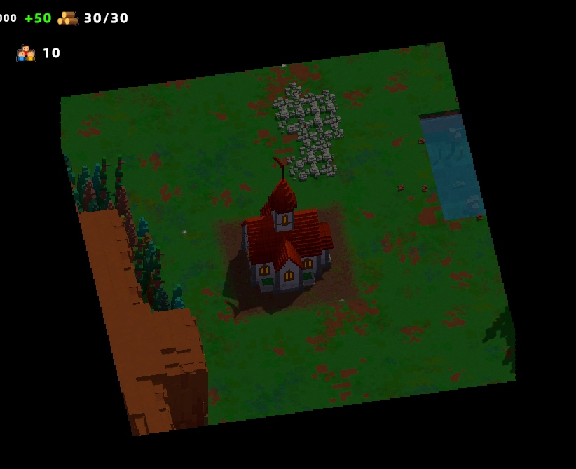
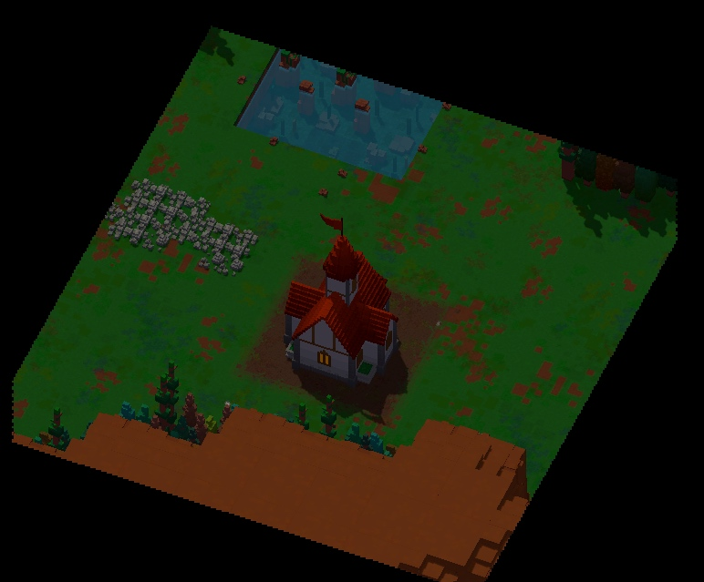
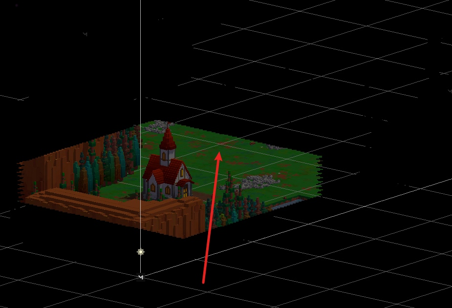
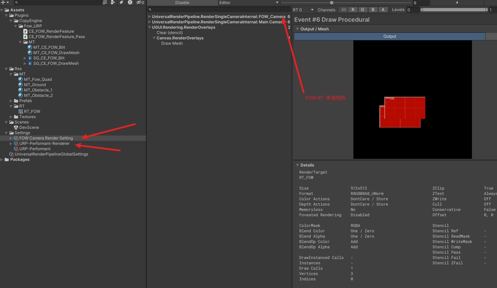
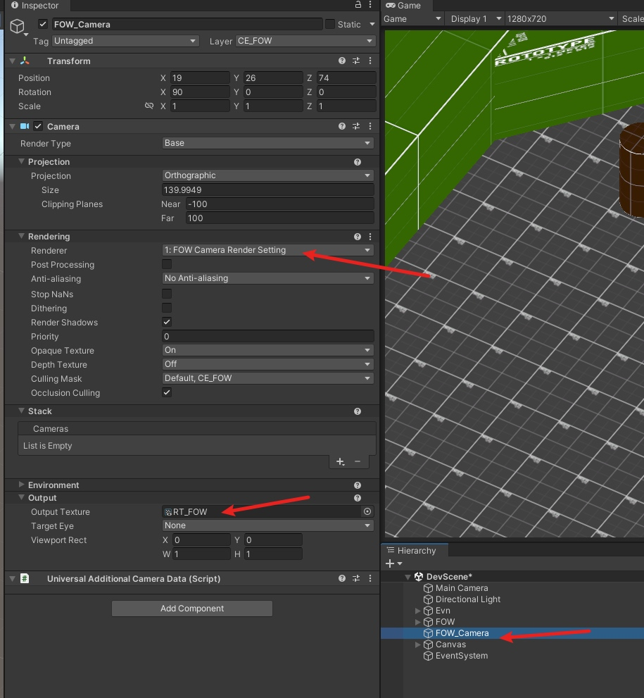

# Fog of War URP V2

第一版本大意了, 没有闪. 好久没搞FOW了. 最后按V1方法做出来的效果 和早期参考的那个FOW犯了同一个问题

直接去原相机去Render出来的RT角度不对. 不能直接Cover上去. 相机的俯角越低效果越明显

## 新思路

所以方法和旧版的FOW差不多.

- 首先用正交的相机 直接渲染出一个FOW的位置RT
- 旧版这块是直接每个物体的Shader内去读WorldPos,然后去Sampling FOW的RT. 不过这样的弊端就是需要重写所有的Shader
- 现在采用的做法就是 用Full Screen Blit 通过 DepthTexutre 去反推出物体的WorldPositon. 这样只要添加一个RenderFeatuer即可

