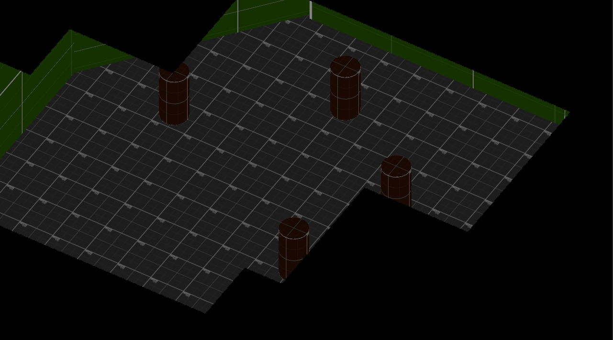
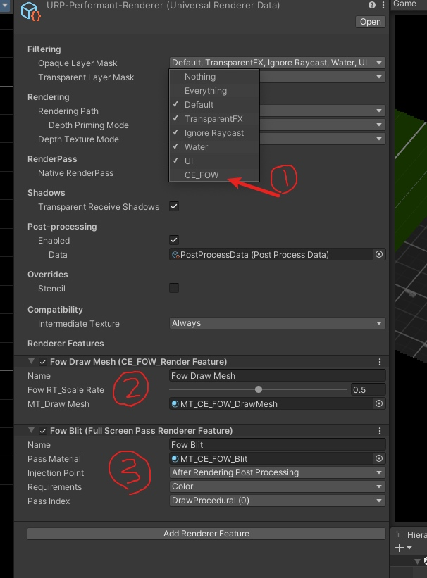
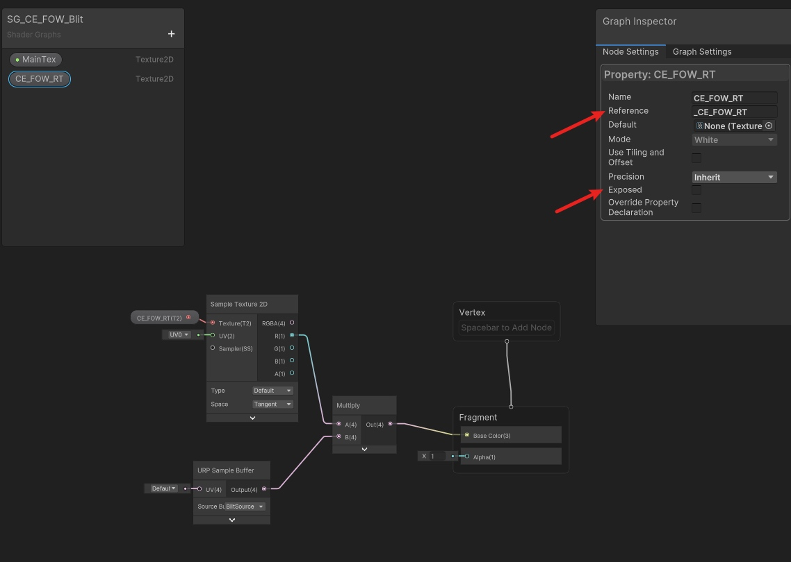

# Update 20230417

初始版本实现有问题, 参考V2版本 [Link](./FOW_V2.md)

# CE FOW URP

CopyEngine Fog of War System in URP for mobile

# 说明

- 工程只适合SPR的渲染管线,Build-In无法使用
- 工程实现了一个思路,无法直接拿来用. 不知道如何使用的可以联系我.

# 如何使用

- 首先创建一个单独的层级`CE_FOW` 并且把该层级从主渲染层级内剔除
    - 这样所有放置在该层级下的物体不会被渲染
- 使用单独的Shader去渲染这个层级下的Mesh到一个临时的RT("_CE_FOW_RT")
- 用自带的FullScreenRender(Blit)去叠加 FOW 到原本的相机上
    - 不单独去写Blit的好处是,这部分可以跟着URP去升级,后期无需关心优化以及API变化问题
    - 如果要整合自己去写可以参考 @Cyanilux 的 [Blit](https://github.com/Cyanilux/URP_BlitRenderFeature) 或者 URP 内的 `FullScreenPassRendererFeature.cs`

## Blit 的 ShaderGraph 如何构造

- 用`_CE_FOW_RT`去访问相应的纹理
- `URP Sample Buffer`去访问原始相机的纹理

具体的可以参考[官方文档](https://docs.unity3d.com/Packages/com.unity.render-pipelines.universal@16.0/manual/post-processing/post-processing-custom-effect-low-code.html)

# What's Next

## 构建特殊Mesh
- 按这个思路处理以后 FOW的整理逻辑就从 写Shader 转移到 构建Mesh了
- 一个简单的思路. Mesh设置VectorColor. 其中 R通道表示是否已经探索过. G通道表示当前是否在迷雾内
- 构建的两点顶点 A(R,B = 1,1) -> B(R,G = 0,0) 可以很自然的Lerp过去.无需做任何处理就可以实现比较好的渐变效果

## 处理FOW RT
- FOW 的RT 是downsize的 可以blur 或者做一些其他的处理. 然后采样回去 edge部分会过度的更丝滑一些

## 序列化
- 这部分最简单了. 直接对生成的Mesh 序列化反序列化即可.

# Contact

- iamzealotwang@126.com
- QQ: 1641547022

